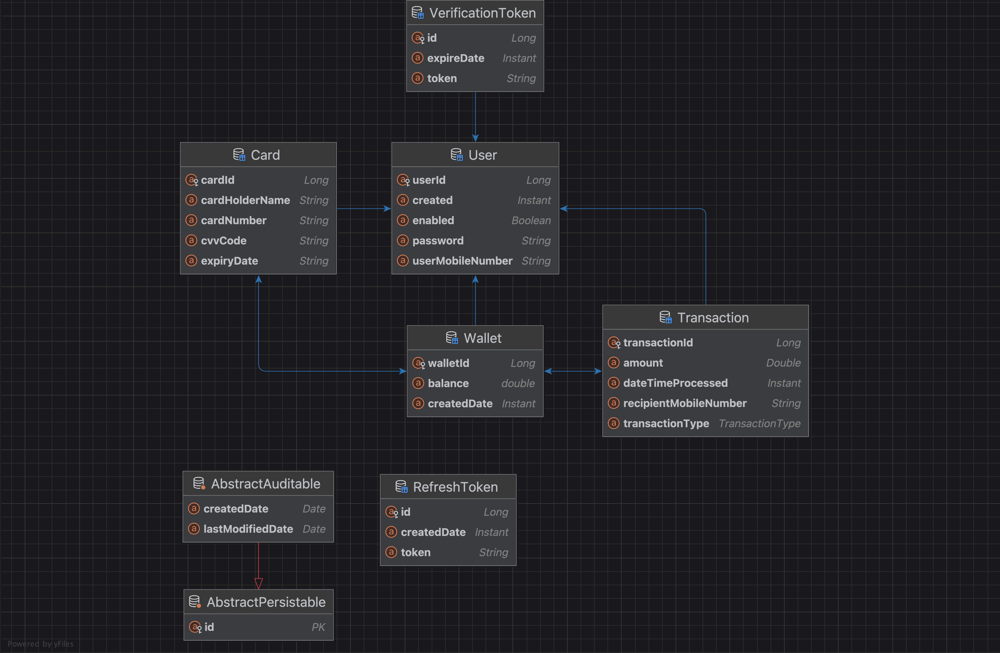

# Simple Wallet Service

Simple Wallet Service is a Java-based web application that provides wallet management and transaction processing
functionalities. It allows users to create wallets, save cards, and perform various financial transactions securely. The
service is built using Spring Boot and employs modern security measures to protect user data and transactions.

## Table of Contents

- [Getting Started](#getting-started)
    - [Prerequisites](#prerequisites)
    - [Configuration](#configuration)
    - [Authentication](#authentication)
- [Usage](#usage)
- [ER-diagram](#er-diagram)
- [Endpoints](#endpoints)
- [License](#license)

## Getting Started

### Prerequisites

- Java 17
- Spring Boot 3
- Spring Data JPA with PostgreSQL 12
- Spring Security 6 with OAuth2
- JUnit 5
- Gradle 8.2
- Docker
- Lombok

### Configuration

- Before running the API server, the database config should be updated inside the application.properties file.
- Update the port number, username and password as per your local database config. The default:
    - server.port=8080
    - spring.datasource.url=jdbc:postgresql://localhost:5430/demoDB
    - spring.datasource.driver-class-name=org.postgresql.Driver
    - spring.datasource.username=usr
    - spring.datasource.password=pwd
    - jwt.public.key=classpath:app.pub
    - jwt.private.key=classpath:app.key

### Authentication

The application uses OAuth2 for authentication. To access the protected endpoints, you need to include an access
token in the Authorization header of your HTTP requests. The access token can be obtained by signing in or refreshing
the token using the appropriate endpoints.

To authenticate, include the access token in the request header as follows:

`Authorization: Bearer your_access_token`

## Usage

The application exposes a REST API that can be accessed using any API client like Postman, curl, or any other tool
that supports making HTTP requests.

## ER-diagram

## Endpoints

### AuthController

- `POST /api/auth/signup`: Handle user signup. (Request body: SignupRequest, Response: ResponseEntity<String>)
- `GET /api/auth/account_verification/{token}`: Handle account verification using token. (Path variable: token,
  Response: ResponseEntity<String>)
- `POST /api/auth/signin`: Handle user signin. (Request body: SigninRequest, Response: AuthenticationResponse)
- `POST /api/auth/refresh/token`: Handle token refresh. (Request body: RefreshTokenRequest, Response:
  AuthenticationResponse)
- `POST /api/auth/signout`: Handle user signout and delete refresh token. (Request body: RefreshTokenRequest, Response:
  ResponseEntity<String>)

### CardController

- `POST /api/cards`: Save a new card. (Request body: CardDto, Response: ResponseEntity<Card>)
- `GET /api/cards/by-wallet/{walletId}`: Get all cards for a given wallet. (Path variable: walletId, Response:
  ResponseEntity<List<CardDto>>)

### TransactionController

- `POST /api/transactions`: Process a new transaction. (Request body: TransactionRequest, Response:
  ResponseEntity<Transaction>)
- `GET /api/transactions/by-wallet/{walletId}`: Get all transactions for a given wallet. (Path variable: walletId,
  Response: ResponseEntity<List<TransactionResponse>>)

### WalletController

- `POST /api/wallets`: Create a new wallet. (Request body: WalletDto, Response: ResponseEntity<Wallet>)
- `GET /api/wallets`: Get all wallets for the user. (Response: ResponseEntity<List<WalletDto>>)
- `GET /api/wallets/by-wallet/{walletId}`: Get balance for a given wallet. (Path variable: walletId, Response:
  ResponseEntity<String>)

## License

The Simple Wallet Service is open-source and available under the [MIT License](./LICENSE). Feel free to use, modify, and
distribute the code as per the license terms.
